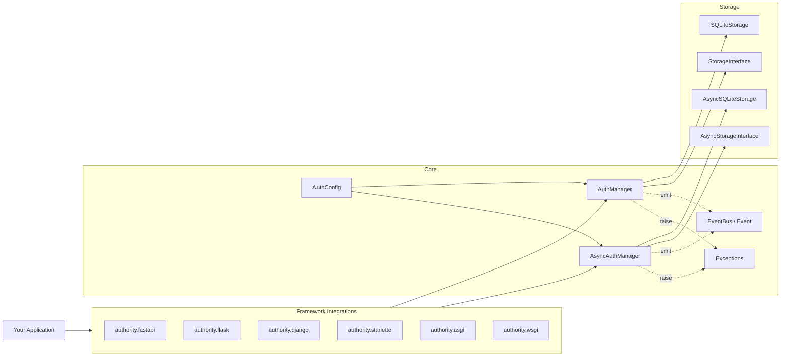

<div align="center">


# Authority

**Comprehensive, framework-agnostic Python authentication library**

[](https://pypi.org/project/authority-auth/)
[](https://pypi.org/project/authority-auth/)
[](https://github.com/rkriad585/authority/blob/main/LICENSE)
[](https://github.com/rkriad585/authority/actions/workflows/ci.yml)
[](https://github.com/rkriad585)

</div>

A batteries-included authentication and authorization library for Python.
JWT access tokens with refresh rotation, TOTP MFA with recovery codes,
WebAuthn/passkey support, RBAC, API key management, password security with
HIBP breach checking, and pluggable storage — all framework-agnostic.

<p align="center">
  <a href="https://raw.githubusercontent.com/rkriad585/authority/main/Screenshots/home.png">
    
  </a>
  <br>
  <sub>More screenshots in <a href="docs/screenshots.md">docs/screenshots.md</a></sub>
</p>

## Table of Contents

- [Features](#features)
- [Requirements](#requirements)
- [Installation](#installation)
- [Quick Start](#quick-start)
- [Async Usage](#async-usage)
- [Framework Integrations](#framework-integrations)
- [MFA Setup](#mfa-setup)
- [RBAC](#rbac)
- [API Keys](#api-keys)
- [Event System](#event-system)
- [Configuration](#configuration)
- [Interface](#interface)
- [Architecture](#architecture)
- [Documentation](#documentation)
- [Development](#development)
- [Contributing](#contributing)
- [Security](#security)
- [License](#license)

## Features

- **JWT Authentication** — Access tokens (HS256) with short-lived expiry and opaque refresh tokens with rotation, family tracking, and reuse detection
- **TOTP MFA** — Time-based one-time passwords with Fernet-encrypted secrets and single-use recovery codes
- **WebAuthn / Passkeys** — Registration and authentication via the WebAuthn standard
- **RBAC** — Role-based access control with granular permissions
- **API Keys** — Prefix-based lookup, scoped keys with optional expiry
- **Password Security** — Configurable complexity rules, password history enforcement, and HIBP breach checking via k-anonymity
- **Pluggable Storage** — Sync and async SQLite backends included; implement `StorageInterface` or `AsyncStorageInterface` for any database
- **Event Bus** — Typed lifecycle events (login, MFA, token refresh, RBAC changes, audit, etc.) with sync and async handler support
- **Audit Logging** — Append-only audit trail with optional chain hashing for tamper evidence
- **Framework-Agnostic** — First-party integrations for FastAPI, Flask, Django, and Starlette, plus generic ASGI/WSGI middleware for everything else
- **Full Async Support** — `AsyncAuthManager` with `AsyncSQLiteStorage` for async-first applications

## Requirements

- Python 3.10+
- SQLite (included in Python standard library)

## Installation

```bash
pip install authority-auth
```

Optional extras:

| Extra | Provides |
|---|---|
| `async` | `aiosqlite`-backed `AsyncSQLiteStorage` |
| `fastapi` | FastAPI integration (`authority.fastapi`) |
| `flask` | Flask integration (`authority.flask`) |
| `django` | Django integration (`authority.django`) |
| `starlette` | Starlette integration (`authority.starlette`) |
| `quart` | Quart is supported through the ASGI middleware |
| `dev` | Development tooling (pytest, ruff, pyright, test frameworks) |
| `docs` | MkDocs + Material for building the documentation site |

```bash
pip install "authority-auth[async]"
pip install "authority-auth[fastapi,flask]"
```

## Quick Start

```python
from authority import AuthConfig, AuthManager
from authority.storage import SQLiteStorage

# Configure
config = AuthConfig(
    jwt_secret_key="your-secret-key-min-32-chars",
    fernet_key="your-fernet-key",  # Generate with: python -c "from cryptography.fernet import Fernet; print(Fernet.generate_key().decode())"
)

# Initialize storage (creates/opens the database)
storage = SQLiteStorage("auth.db")

# Create the auth manager
auth = AuthManager(config, storage)

# Register a user
user = auth.register(
    name="Alice",
    email="alice@example.com",
    password="SecureP@ssw0rd!",
    auto_verify=True,
)
print(f"Registered user: {user['id']}")

# Login
result = auth.login(email="alice@example.com", password="SecureP@ssw0rd!")
print(f"Access token: {result['access_token'][:20]}...")
print(f"Refresh token: {result['refresh_token'][:20]}...")

# Verify an access token
payload = auth.verify_access_token(result["access_token"])
print(f"User ID from token: {payload['user_id']}")

# Refresh tokens
new_tokens = auth.refresh_access_token(result["refresh_token"])

# Logout
auth.logout(
    user_id=user["id"],
    refresh_token=result["refresh_token"],
    access_token_jti=payload["jti"],
)

# Clean up
auth.close()
```

## Async Usage

```python
import asyncio
from authority import AuthConfig, AsyncAuthManager
from authority.storage import AsyncSQLiteStorage

async def main():
    config = AuthConfig(
        jwt_secret_key="your-secret-key-min-32-chars",
        fernet_key="your-fernet-key",
    )

    storage = AsyncSQLiteStorage("auth.db")
    await storage.connect()

    auth = AsyncAuthManager(config, storage)

    # Register
    user = await auth.register(
        name="Bob",
        email="bob@example.com",
        password="SecureP@ssw0rd!",
        auto_verify=True,
    )

    # Login
    result = await auth.login(email="bob@example.com", password="SecureP@ssw0rd!")
    print(f"Access token: {result['access_token'][:20]}...")

    # Verify
    payload = await auth.verify_access_token(result["access_token"])
    print(f"User ID: {payload['user_id']}")

    # Refresh
    new_tokens = await auth.refresh_access_token(result["refresh_token"])

    # Logout all devices
    count = await auth.logout_all(user_id=user["id"])
    print(f"Revoked {count} tokens")

    await auth.close()

asyncio.run(main())
```

## Framework Integrations

Each integration ships in its own module and requires the matching framework
extra. Fully working apps for every framework live in
[`examples/apps/`](examples/apps/) — see the
[examples documentation](docs/examples/index.md) for run instructions,
endpoints, and the demo account.

```bash
pip install "authority-auth[flask]"    # Flask
pip install "authority-auth[django]"   # Django
pip install "authority-auth[starlette]"  # Starlette
pip install "authority-auth[fastapi]"  # FastAPI
```

### FastAPI

```python
from fastapi import FastAPI, Depends
from authority import AuthConfig, AsyncAuthManager
from authority.storage import AsyncSQLiteStorage
from authority.fastapi import get_current_user, init_auth

app = FastAPI()

config = AuthConfig(
    jwt_secret_key="your-secret-key-min-32-chars",
    fernet_key="your-fernet-key",
)
storage = AsyncSQLiteStorage("auth.db")
auth = AsyncAuthManager(config, storage)
init_auth(auth)


@app.on_event("startup")
async def startup():
    await storage.connect()


@app.on_event("shutdown")
async def shutdown():
    await auth.close()


@app.get("/me")
async def me(user: dict = Depends(get_current_user)):
    return {"id": user["id"], "name": user["name"], "email": user["email"]}
```

### Flask

```python
from flask import Flask, jsonify
from authority import AuthConfig, AuthManager
from authority.storage.sqlite import SQLiteStorage
from authority.flask import FlaskAuth

app = Flask(__name__)
app.secret_key = "app-session-secret"

auth = FlaskAuth(
    app,
    AuthManager(
        AuthConfig(jwt_secret_key="your-secret-key-min-32-chars", fernet_key="your-fernet-key"),
        SQLiteStorage("auth.db"),
    ),
)

@app.route("/me")
@auth.login_required
def me():
    user = auth.current_user()  # full user dict, or None
    return jsonify({"id": user["id"], "email": user["email"]})

@app.route("/admin")
@auth.require_permission("admin.access")
def admin():
    return "Welcome, admin!"
```

Tokens are read from the `Authorization: Bearer <token>` header, or from
`session["access_token"]` for session-based flows. Module-level helpers
(`init_auth`, `login_required`, `require_permission`, `require_role`,
`current_user`) are also available.

### Django

```python
from django.contrib.auth import authenticate
from django.http import JsonResponse
from django.urls import path
from authority.django import get_current_user, init_auth, login_required, require_permission

init_auth(auth_manager)  # an authority.AuthManager

@login_required
def me(request):
    user = get_current_user(request)
    return JsonResponse({"email": user["email"]})

urlpatterns = [path("me", me)]
```

Add `authority.django.AuthorityBackend` to `AUTHENTICATION_BACKENDS` to
authenticate Django users with authority credentials, and use
`authority_user_to_django_user()` to mirror authority users into
`django.contrib.auth.models.User` (same primary key, unusable password).

### Starlette

```python
from starlette.applications import Starlette
from starlette.routing import Route
from starlette.responses import JSONResponse
from authority.starlette import StarletteAuth

auth = StarletteAuth(async_manager)  # an authority.AsyncAuthManager

@auth.require_role("admin")
async def admin(request):
    return JSONResponse({"message": "Welcome, admin!"})

app = Starlette(routes=[Route("/admin", admin)])
```

### Generic middleware

For frameworks without a dedicated helper (or for bare applications), use the
framework-agnostic middleware. Both attach the auth result to the request
(`scope["authority"]` / `environ["authority"]`) and provide `get_user_state`,
`is_authenticated`, `user_id_from_scope` / `user_id_from_environ`, and
`get_current_user` helpers.

```python
# ASGI (works with Starlette, FastAPI, Quart, bare ASGI apps)
from authority.asgi import AuthorityASGIMiddleware

app = AuthorityASGIMiddleware(inner_app, async_manager, auth_required=True)
```

```python
# WSGI (works with Flask, Django, bare WSGI apps)
from authority.wsgi import AuthorityWSGIMiddleware

app = AuthorityWSGIMiddleware(inner_app, manager, auth_required=True)
```

With `auth_required=True` unauthenticated requests are rejected with a 401 JSON
response before reaching the application.

## MFA Setup

TOTP-based multi-factor authentication with encrypted secret storage and recovery codes:

```python
# Initiate MFA setup -- returns secret and provisioning URI
setup = auth.setup_mfa(user_id=user["id"])
print(f"Secret: {setup['secret']}")
print(f"URI: {setup['provisioning_uri']}")
# Show this URI as a QR code in your frontend

# User scans QR code, enters 6-digit code to confirm
result = auth.verify_and_enable_mfa(user_id=user["id"], code="123456")
print(f"Recovery codes (store these!): {result['recovery_codes']}")

# During login, after password succeeds:
login_result = auth.login(email="alice@example.com", password="...")
if login_result.get("mfa_required"):
    # Ask user for TOTP code or recovery code
    tokens = auth.verify_mfa_login(
        user_id=login_result["user_id"],
        code="654321",  # TOTP code or recovery code
    )

# Check MFA status
status = auth.get_mfa_status(user_id=user["id"])
print(f"MFA enabled: {status['mfa_enabled']}")
print(f"Recovery codes remaining: {status['recovery_codes_remaining']}")

# Disable MFA (requires password re-authentication)
auth.disable_mfa(user_id=user["id"], password="...")
```

## RBAC

Role-based access control with permissions:

```python
# Create roles
admin_role = auth.create_role("admin", "Full system access")
editor_role = auth.create_role("editor", "Can edit content")

# Create permissions
read_perm = auth.create_permission("posts:read")
write_perm = auth.create_permission("posts:write")
delete_perm = auth.create_permission("posts:delete")

# Assign permissions to roles
auth.assign_permission_to_role(admin_role["id"], read_perm["id"])
auth.assign_permission_to_role(admin_role["id"], write_perm["id"])
auth.assign_permission_to_role(admin_role["id"], delete_perm["id"])
auth.assign_permission_to_role(editor_role["id"], read_perm["id"])
auth.assign_permission_to_role(editor_role["id"], write_perm["id"])

# Assign roles to users
auth.assign_role_to_user(user_id=1, role_id=admin_role["id"])

# Check permissions
if auth.has_permission(user_id=1, permission_code="posts:delete"):
    print("User can delete posts")

# Get all effective permissions
perms = auth.get_user_permissions(user_id=1)
# ["posts:read", "posts:write", "posts:delete"]
```

## API Keys

Scoped API keys with prefix-based lookup:

```python
# Create an API key
key_result = auth.create_api_key(
    user_id=user["id"],
    description="Production API access",
    scopes=["read", "write"],
    expires_in_days=90,
)
print(f"Key (save this, shown only once): {key_result['key']}")
print(f"Prefix: {key_result['prefix']}")

# Verify an API key (e.g., from a request header)
key_info = auth.verify_api_key(key_result["key"])
print(f"User: {key_info['user_id']}, Scopes: {key_info['scopes']}")

# List all API keys for a user
keys = auth.list_api_keys(user_id=user["id"])
for k in keys:
    print(f"{k['key_prefix']}... - {k['description']}")

# Revoke an API key
auth.revoke_api_key(user_id=user["id"], key_prefix=key_result["prefix"])
```

## Event System

Subscribe to lifecycle events for logging, notifications, analytics, or custom workflows:

```python
from authority import EventBus, Event

bus = EventBus()

# Sync handler
def on_login(data):
    print(f"Login: user {data['user_id']} from {data.get('ip_address')}")

# Async handler
async def on_register(data):
    await send_welcome_email(data["email"])

bus.on(Event.USER_LOGIN_SUCCESS, on_login)
bus.on(Event.USER_REGISTERED, on_register)

# Pass the event bus when creating the manager
auth = AuthManager(config, storage, event_bus=bus)
```

All 22 event types:

| Event | Payload summary |
|---|---|
| `USER_REGISTERED` | new user |
| `USER_LOGIN_SUCCESS` | user id, IP, user agent |
| `USER_LOGIN_FAILED` | email, reason |
| `USER_LOGOUT` | user id |
| `USER_PASSWORD_CHANGED` | user id |
| `USER_PASSWORD_RESET` | user id, email |
| `USER_EMAIL_CHANGED` | user id |
| `USER_DELETED` | user id |
| `MFA_SETUP_INITIATED` | user id |
| `MFA_ENABLED` | user id |
| `MFA_DISABLED` | user id |
| `MFA_FAILED` | user id, reason |
| `TOKEN_REFRESHED` | user id, token family |
| `TOKEN_REUSE_DETECTED` | user id, token family |
| `TOKEN_REVOKED` | user id |
| `WEBAUTHN_CREDENTIAL_ADDED` | user id |
| `WEBAUTHN_CREDENTIAL_REMOVED` | user id |
| `RBAC_ROLE_ASSIGNED` | user id, role |
| `RBAC_ROLE_REVOKED` | user id, role |
| `API_KEY_CREATED` | user id |
| `API_KEY_REVOKED` | user id |
| `AUDIT_EVENT_LOGGED` | audit entry |

## Configuration

`AuthConfig` accepts values via constructor arguments, environment variables
(prefixed with `AUTHORITY_`), or defaults. Constructor kwargs take highest
priority.

| Parameter | Env Var | Default | Description |
|---|---|---|---|
| `db_path` | `AUTHORITY_DB_PATH` | `"authority_data.db"` | Path to the SQLite database file |
| `prune_tokens_on_startup` | -- | `True` | Prune expired tokens when the manager opens |
| `jwt_secret_key` | `AUTHORITY_JWT_SECRET_KEY` | `""` | **Required.** Secret key for signing JWTs |
| `fernet_key` | `AUTHORITY_FERNET_KEY` | `""` | **Required.** Fernet key for encrypting MFA secrets |
| `jwt_algorithm` | -- | `"HS256"` | JWT signing algorithm |
| `jwt_access_token_expiry_minutes` | -- | `15` | Access token lifetime in minutes |
| `jwt_refresh_token_expiry_days` | -- | `7` | Refresh token lifetime in days |
| `jwt_refresh_token_absolute_max_days` | -- | `30` | Maximum refresh token age regardless of rotation |
| `password_min_length` | -- | `12` | Minimum password length |
| `password_history_depth` | -- | `5` | Number of previous passwords to remember |
| `password_require_complexity` | -- | `True` | Enforce complexity regex |
| `password_complexity_regex` | -- | see below | Regex used for complexity checks |
| `password_prevent_email_username_use` | -- | `True` | Reject passwords containing the email or username |
| `hibp_check_enabled` | -- | `False` | Check passwords against HIBP breach database |
| `hibp_api_key` | `AUTHORITY_HIBP_KEY` | `""` | Optional HIBP API key |
| `hibp_failure_mode` | -- | `"warn"` | `"reject"`, `"warn"`, or `"ignore"` |
| `failed_login_lockout_threshold` | -- | `5` | Failed attempts before lockout |
| `failed_login_lockout_minutes` | -- | `15` | Lockout duration in minutes |
| `email_verification_required` | -- | `True` | Require email verification on signup |
| `verification_token_expiry_minutes` | -- | `1440` | Email verification token lifetime |
| `password_reset_token_expiry_minutes` | -- | `30` | Password reset token lifetime |
| `email_change_token_expiry_minutes` | -- | `60` | Email change token lifetime |
| `mfa_issuer_name` | -- | `"Authority Powered App"` | Issuer name shown in authenticator apps |
| `mfa_recovery_code_count` | -- | `10` | Number of recovery codes generated |
| `mfa_totp_valid_window` | -- | `1` | TOTP valid window (±1 step = 30s each) |
| `refresh_token_rotate` | -- | `True` | Rotate refresh tokens on use |
| `refresh_token_reuse_grace_seconds` | -- | `10` | Grace period for legitimate refresh retries |
| `webauthn_rp_id` | `AUTHORITY_WEBAUTHN_RP_ID` | `""` | WebAuthn relying party ID |
| `webauthn_rp_name` | -- | `"My Application"` | WebAuthn relying party name |
| `webauthn_expected_origin` | `AUTHORITY_WEBAUTHN_ORIGIN` | `""` | Expected origin for WebAuthn |
| `webauthn_timeout_ms` | -- | `60000` | WebAuthn ceremony timeout |
| `audit_log_enabled` | -- | `True` | Enable audit logging |
| `default_user_role` | -- | `"user"` | Default role assigned to new users |
| `api_key_byte_length` | -- | `32` | Byte length of generated API keys |

The default complexity regex is
`^(?=.*[a-z])(?=.*[A-Z])(?=.*\d)(?=.*[\W_]).{12,}$` — at least 12 characters
containing lowercase, uppercase, a digit, and a special character.

## Interface

Authority exposes a small, stable public API surface.

### Core managers

- `AuthManager` (`authority.core`) — synchronous manager. Construct with
  `AuthManager(config, storage, event_bus=None)`; open with `.open()`, close
  with `.close()`.
- `AsyncAuthManager` (`authority.async_core`) — asyncio-native equivalent with
  the same 55-method surface as coroutines.

Both expose methods grouped by concern:

- **Users** — `register`, `get_user`, `get_profile`, `update_user`,
  `update_profile`, `delete_user`, `request_email_verification`, `verify_email`,
  `request_email_change`, `confirm_email_change`, `request_password_reset`,
  `reset_password`, `change_password`
- **Authentication** — `login`, `logout`, `logout_all`,
  `verify_access_token`, `refresh_access_token`, `require_permission`
- **Sessions** — `list_sessions`, `revoke_session_by_id`,
  `revoke_all_sessions_for_user`
- **MFA** — `setup_mfa`, `verify_and_enable_mfa`, `get_mfa_status`,
  `disable_mfa`, `verify_mfa_login`, `verify_mfa_recovery_code`,
  `regenerate_recovery_codes`
- **WebAuthn** — `start_webauthn_registration`, `complete_webauthn_registration`,
  `start_webauthn_authentication`, `complete_webauthn_authentication`,
  `list_webauthn_credentials`, `delete_webauthn_credential`
- **RBAC** — `create_role`, `delete_role`, `list_roles`, `create_permission`,
  `delete_permission`, `list_permissions`, `assign_permission_to_role`,
  `remove_permission_from_role`, `get_role_permissions`, `assign_role_to_user`,
  `remove_role_from_user`, `get_user_roles`, `has_permission`,
  `get_user_permissions`
- **API keys** — `create_api_key`, `verify_api_key`, `list_api_keys`,
  `revoke_api_key`
- **Audit** — `get_audit_log`

See [docs/api.md](docs/api.md) for the complete reference.

### Configuration

- `AuthConfig` (`authority.config`) — dataclass of all knobs; see
  [Configuration](#configuration).

### Events

- `Event` (`authority.events`) — enum of the 22 lifecycle events.
- `EventBus` (`authority.events`) — `.on(event, handler)`, `.emit(event, data)`
  with sync and async handler support.

### Exceptions

`AuthError` is the base of a 24-class hierarchy. Public exceptions include
`ConfigurationError`, `DatabaseError`, `ValidationError`, `UserExistsError`,
`UserNotFoundError`, `InvalidCredentialsError`, `AccountInactiveError`,
`AccountNotVerifiedError`, `AccountLockedError`, `InvalidTokenError`,
`TokenExpiredError`, `MFARequiredError`, `MFAFailedError`,
`InvalidRecoveryCodeError`, `MFANotEnabledError`, `PasswordPwnedError`,
`PermissionError`, `InsufficientPermissionsError`, `WebAuthnError`,
`WebAuthnRegistrationError`, `WebAuthnVerificationError`,
`InvalidAPIKeyError`, and `RateLimitExceededError`. All are importable from
`authority`; see [docs/api.md](docs/api.md) for the full hierarchy.

### Storage

- `StorageInterface` (`authority.storage.base`) — abstract sync storage contract.
- `AsyncStorageInterface` (`authority.storage.base`) — abstract async storage contract.
- `SQLiteStorage` (`authority.storage.sqlite`) — sync SQLite implementation.
- `AsyncSQLiteStorage` (`authority.storage.aiosqlite`) — async SQLite implementation.

### Utils

`generate_secure_token`, `hash_token`, `encrypt_data`, `decrypt_data`,
`reset_fernet_cache`, `check_password_pwned`, `estimate_password_strength`,
`validate_email_format` — all importable from `authority`.

## Architecture

```
┌────────────────────────────────────────────────────────────────────┐
│                        Your Application                            │
│                  routes / handlers / middlewares                   │
└───────────────┬───────────────────────────────────┬────────────────┘
                │                                   │
                ▼                                   ▼
  ┌──────────────────────────┐       ┌───────────────────────────┐
  │    Framework Adapters     │       │   Generic Middleware      │
  │  authority.fastapi        │       │   authority.asgi          │
  │  authority.flask          │       │   authority.wsgi          │
  │  authority.django         │       │  (any ASGI / WSGI app)    │
  │  authority.starlette      │       └─────────────┬─────────────┘
  └─────────────┬────────────┘                     │
                │                                   │
                └────────────────┬──────────────────┘
                                 ▼
                    ┌─────────────────────────┐
                    │   authority.core        │
                    │  AuthManager (sync)     │
                    │  AsyncAuthManager       │
                    │  AuthConfig             │
                    │  EventBus / Event       │
                    │  Exceptions             │
                    └───────────┬─────────────┘
                                │
                     ┌──────────┴──────────┐
                     ▼                     ▼
        ┌──────────────────────┐  ┌───────────────────────┐
        │ StorageInterface     │  │ AsyncStorageInterface │
        │ SQLiteStorage (sync) │  │ AsyncSQLiteStorage    │
        │   or your own        │  │   or your own         │
        └──────────────────────┘  └───────────────────────┘
```

Mermaid equivalent:



## Documentation

Full documentation is built with MkDocs Material and published to
<https://rkriad585.github.io/authority/>.

| Page | Description |
|---|---|
| [Home](docs/index.md) | Landing page with logo, overview, and quick links |
| [Getting Started](docs/getting-started.md) | First steps with authority |
| [Installation](docs/installation.md) | Install options and extras |
| [Usage](docs/usage.md) | Sync & async usage, tokens, MFA, RBAC, API keys |
| [Configuration](docs/configuration.md) | Every `AuthConfig` option and env var |
| [API Reference](docs/api.md) | Full public API inventory |
| [Architecture](docs/architecture.md) | Design overview and module map |
| [Development](docs/development.md) | Setup, testing, linting, CI |
| [Deployment](docs/deployment.md) | Production guidance |
| [Screenshots](docs/screenshots.md) | All generated screenshots |
| [FAQ](docs/faq.md) | Frequently asked questions |
| [Troubleshooting](docs/troubleshooting.md) | Common issues and fixes |
| [Examples](docs/examples/index.md) | All example applications |

### Example applications

| App | Stack | Docs |
|---|---|---|
| [Flask](examples/apps/flask_app/) | Flask + SQLite (sync) | [flask.md](docs/examples/flask.md) |
| [Django](examples/apps/django_app/) | Django + SQLite (sync) | [django.md](docs/examples/django.md) |
| [WSGI](examples/apps/wsgi_app/) | Bare WSGI + middleware (sync) | [wsgi.md](docs/examples/wsgi.md) |
| [FastAPI](examples/apps/fastapi_app/) | FastAPI + aiosqlite (async) | [fastapi.md](docs/examples/fastapi.md) |
| [Starlette](examples/apps/starlette_app/) | Starlette + aiosqlite (async) | [starlette.md](docs/examples/starlette.md) |
| [ASGI](examples/apps/asgi_app/) | Bare ASGI + middleware (async) | [asgi.md](docs/examples/asgi.md) |

## Development

See [docs/development.md](docs/development.md) for the full guide.

```bash
git clone https://github.com/rkriad585/authority.git
cd authority

# Create a virtual environment
python -m venv .venv
.venv\Scripts\activate   # Windows
# source .venv/bin/activate  # macOS / Linux

# Install in editable mode with dev extras
pip install -e ".[dev]"

# Run the test suite
pytest

# Lint and type-check
ruff check .
pyright
```

## Contributing

Contributions are welcome. Please read [CONTRIBUTING.md](CONTRIBUTING.md) for
guidelines, and note that this project adheres to a
[Code of Conduct](CODE_OF_CONDUCT.md).

## Security

See [SECURITY.md](SECURITY.md) for the full security policy, vulnerability
reporting process, and security considerations.

Key security properties:

- Algorithm pinned in every `jwt.decode()` call to prevent algorithm confusion
- Refresh tokens stored as SHA-256 hashes, never plaintext
- Token rotation with family tracking and automatic revocation on reuse
- MFA secrets encrypted at rest with Fernet (AES-128-CBC)
- Passwords hashed with bcrypt (cost factor 12+)
- HIBP integration uses k-anonymity (only SHA-1 prefix sent)
- Audit log is append-only with chain hashing for tamper evidence

## License

[MIT](LICENSE) — authority-auth (c) 2023 rkriad585.
