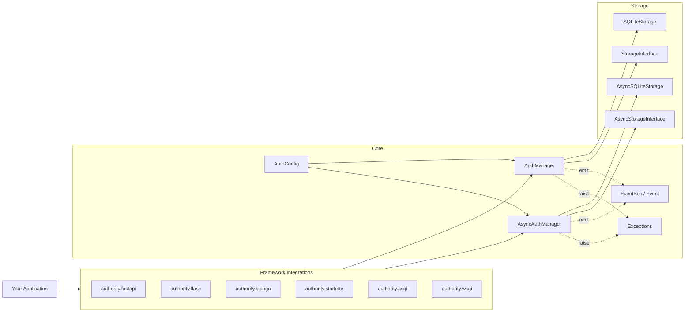

# Architecture

## Overview

Authority is layered so that the core is completely framework-agnostic:

1. **Core layer** — `AuthManager` (sync) and `AsyncAuthManager` implement all
   business logic. They depend only on `AuthConfig`, an
   `EventBus`, and a storage backend.
2. **Storage layer** — `StorageInterface` / `AsyncStorageInterface` abstract
   persistence. `SQLiteStorage` and `AsyncSQLiteStorage` are the built-in
   implementations; any database can be plugged in by implementing the
   interface.
3. **Integration layer** — thin adapters (`fastapi.py`, `flask.py`,
   `django.py`, `starlette.py`) and generic middleware (`asgi.py`, `wsgi.py`)
   that translate framework request objects into calls against the manager.

## Module map

| Module | Responsibility |
|---|---|
| `config.py` | `AuthConfig` dataclass; env-var resolution |
| `core.py` | `AuthManager` — sync implementation of all flows |
| `async_core.py` | `AsyncAuthManager` — async twin with the same surface |
| `events.py` | `Event` enum (22 events), `EventBus` with sync/async handlers |
| `exceptions.py` | 24-class `AuthError` hierarchy |
| `utils.py` | Token generation/hashing, Fernet encryption, HIBP, email validation |
| `storage/base.py` | `StorageInterface`, `AsyncStorageInterface` |
| `storage/sqlite.py` | Sync SQLite storage |
| `storage/aiosqlite.py` | Async SQLite storage |
| `fastapi.py` | FastAPI dependencies (`get_current_user`, `require_permission`, …) |
| `flask.py` | `FlaskAuth` + module helpers |
| `django.py` | `AuthorityBackend` + decorators/helpers |
| `starlette.py` | `StarletteAuth` decorators |
| `asgi.py` | Generic ASGI middleware + state helpers |
| `wsgi.py` | Generic WSGI middleware + state helpers |

## Design decisions

### Sync and async are separate classes

There is no "sync wrapper around async" or vice versa: `AuthManager` and
`AsyncAuthManager` are independent implementations that share the same public
surface, `AuthConfig`, storage interfaces, and exceptions. This keeps blocking
I/O out of the event loop and avoids surprise thread-pool round-trips.

### Storage is behind an interface

The manager never touches SQL directly — it calls the storage backend. This is
what makes the database pluggable and keeps the core unit-testable with fakes.

### Framework adapters are thin

Adapters only translate between the framework's request/response model and the
manager API. All policy lives in the core, so behavior is identical across
FastAPI, Flask, Django, Starlette, and raw ASGI/WSGI.

### Security properties in the core

Token family tracking, reuse detection, audit chain hashing, MFA secret
encryption, and password policies are implemented once, in the core, so every
integration inherits them.

## Data flow: token-based login

1. Client sends `POST /login` with email/password.
2. The framework adapter parses the body and calls `manager.login(...)`.
3. The core verifies credentials, checks lockout state, optionally requires MFA
   (returning `mfa_required`), then creates an access token and a hashed,
   rotated refresh token via the storage layer.
4. The adapter serializes the tokens back to the client.
5. On a protected route, the adapter extracts the `Authorization: Bearer`
   header and calls `manager.verify_access_token(...)`, then passes the user to
   the handler — or the generic middleware verifies the token and stores the
   result in `scope["authority"]` / `environ["authority"]`.
